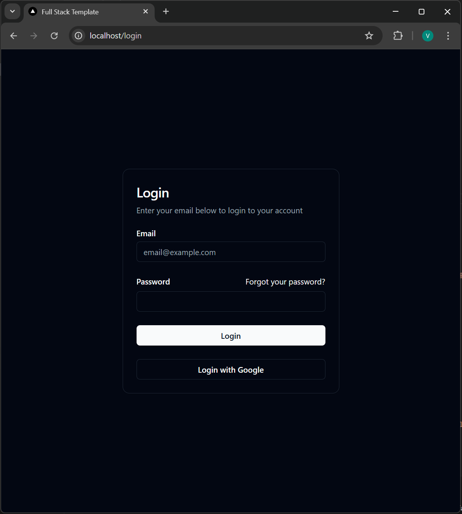
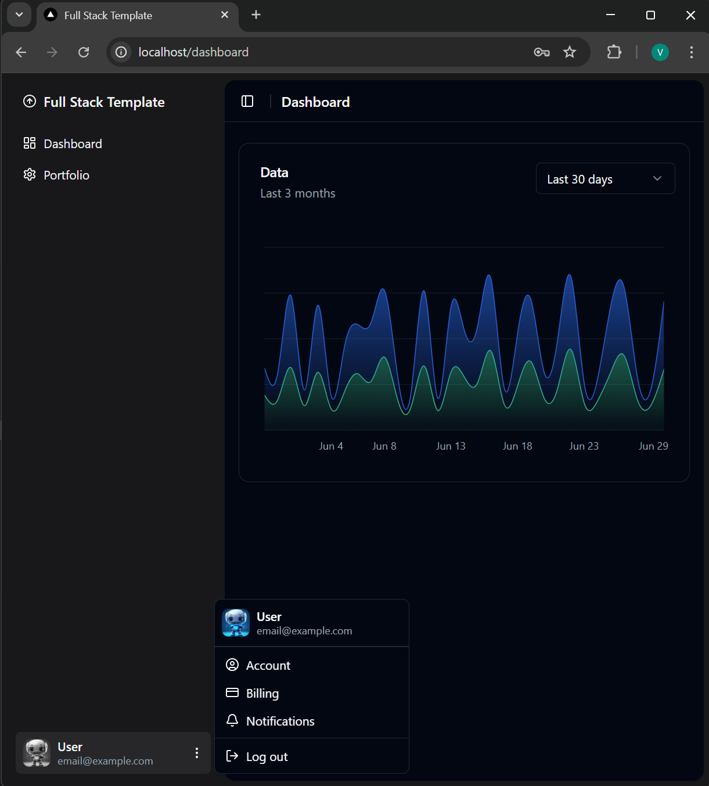

# FST-001
## Full Stack Template for Web Applications


1. Backend -> Django REST Framework. 
2. Frontend -> Next.js + ShadCN/UI.
3. Orchestrated with Docker containers (backend, frontend, PostgreSQL database and nginx).

## Features:
1. Login page with e-mail and password.
2. Dashboard page.

## How to use it:
### Without Docker:
1. Make sure to set DB = SQLite3 (if not using PostgreSQL):
```
let using_docker : boolean = false; // frontend/services/api.ts
USING_DOCKER = False                // backend/prj_core/settings.py
```
2. Backend:
  1. Create virtual environment and install libraries from requirements.txt
  2. Run the development server -> python manage.py runserver
3. Frontend:
  1. npm run build (first time if needed) 
  2. npm run dev (or npm start)
4. With both backend and frontend running, access the application through 'http://localhost:3000'

### With Docker:
1. Make sure to set DB = PostgreSQL:
```
let using_docker : boolean = true; // frontend/services/api.ts
USING_DOCKER = True                // backend/prj_core/settings.py
```
2. Run the server using 'docker compose up --build'.
3. In a new terminal window, create a new user with 'docker compose exec backend sh python manage.py createsuperuser'. Add username, e-mail and password.
4. Access the main page with 'http://localhost' and log into the system using the credentials from (3.2.3).
